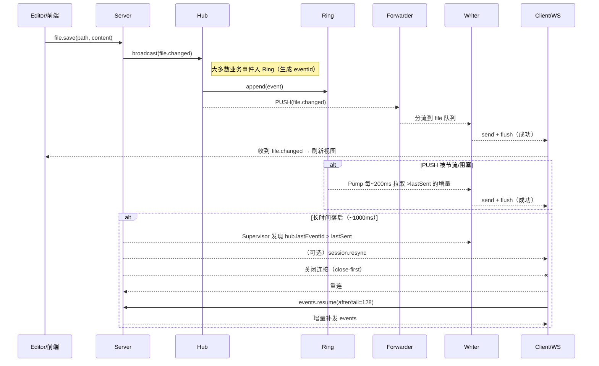

# 架构与目录（已实现）

概览
- 后端：Rust/Axum 二进制 `ailoom-server`，静态托管前端并提供 `/api/*`。
- 领域库：多 crate 解耦（core/fs/store/stitch）。server 仅组装路由与调用库能力。
- 前端：React + Vite + Tailwind v4 + shadcn/ui + Monaco（只读/可选全量编辑）。
- 存储：SQLite（WAL、busy_timeout），默认 `~/ailoom/ailoom.db`，失败回退为项目根 `.ailoom/ailoom.db`。
- 分发：`npx ai-loom` 跨平台封装，按平台选择对应二进制子包运行。

## WS 架构总览（PUSH + PULL）

- 目标：保存后 ≤1s 内页面必然纠正；单/多标签一致；弱网/后台 Tab 也能自愈。
- 思路：同时具备“推送（PUSH）”与“拉取补偿（PULL）”，并用“单写者（send+flush+超时）”保证“真的写出去”。

```
  业务/监听         Hub(广播)            Ring(事件环)        Forwarder(转发)         Writer(单写者)         浏览器WS
  ---------   ┌──────────────────┐   ┌──────────────────┐   ┌──────────────────┐   ┌──────────────────┐   ┌───────────┐
  file.save → │ broadcast(file/*)│ → │ 追加带 eventId   │ → │ 分流：priority   │ → │ send+flush(超时) │ → │ 事件处理   │
  fswatch  →  │ receivers/去重    │   │ 支持 resume/tail │   │ file 队列/ tree  │   │ 成功才记 lastSent │   │ 缓存失效   │
              └──────────────────┘   └──────────────────┘   └──────────────────┘   └──────────────────┘   └───────────┘
                                                       ↑                                         │
                                                       └──────── Pump(每~200ms从 ring 拉增量) ───┘
                                                    Supervisor(对比 hub.lastEventId vs lastSent，落后~1000ms→close-first)
```

- 模块分工（后端）：
  - Hub：像“电台发射塔”，负责广播与轻量去重，打印 receivers/ring 观测。
  - Ring：最近 N 条事件的“播放单”，提供 `events.resume(after/tail)` 与 PULL 拉取。
  - Forwarder：每连接一个，订阅 Hub 后按“priority/file/tree”分流投递给 Writer。
  - Writer：唯一写出任务；所有帧 `send+flush`，失败立刻 close-first（促重连+resume）。
  - Pump：按固定间隔从 Ring 拉取“落下的事件”，确保 PUSH 失效时 ≤1s 也能补上。
  - Supervisor：仅比较“Hub 最新事件 id”与“该连接最后一次成功写出的 id”，落后超阈值触发自愈。

- 三路通道（写出优先级）：
  - priority（mpsc，cap≈64）：RPC 响应、`session.resync` 等关键帧（不丢、优先写）。
  - file（mpsc，cap≈256）：`file.changed`、`annotations.*`（按序、不可丢）。
  - tree（watch keep‑latest）：`tree.changed`（只保留最新，避免刷屏）。

- 前端：
  - 连接、重连与增量恢复：`events.resume(after/tail=128)`。
  - 订阅：根目录、file prefix:''、选中文件 path；`file.changed` → 精确失效；`tree.changed` → 节流重建。
  - 后台 Tab：以 setTimeout 刷新兜底（rAF 在后台不执行）。

更多细节与术语“接地气”解释，见：`docs/guide/ws-overview.md`（含关键时序、术语、开关说明）。

### 运行时（Per‑Conversation，Provider 通用）

- 目标：从根上消除“监听黑洞/串会话”，并在多会话并发下稳定提供实时事件。
- 模式：仅支持 per-conv。每个会话独立拉起一个运行时（CLI 子进程或 API 虚拟任务）；前端仍通过“单 WS + 统一 chat.*”协议收取事件（协议不变）。
- 生命周期
  - 新建：`spawn_new(provider)` → 建立运行时（CLI：进程+握手 / API：虚拟任务）→ 广播 `chat.session.new`
  - 发送：`ensure_listener(provider)`（无则 `resume`）→ `sendUserMessage(provider)`
  - 中断：软中断 `interrupt(provider)`；硬中断仅终止该会话运行时（不影响其它会话）
- 资源治理（默认值可通过环境变量调整）
  - `AILOOM_EXEC_IDLE_MS`（默认 60000）：闲置超过阈值回收运行时
  - `AILOOM_EXEC_MAX_CHILDREN`（默认 6）：最多同时保留的运行时数
  - `AILOOM_EXEC_GC_INTERVAL_MS`（默认 5000）：后台 GC 周期
- 握手异步化
  - `subscribe/subscribeMany` 的握手（`sync_begin → 回放 → sync_end`）在后台任务中异步投递，避免阻塞请求路径
  - Writer 调度采用配额化轮转（`AILOOM_WS_WRITER_LIVE_QUOTA/FILE_QUOTA`），防止回放/文件风暴饿死 live
- 观测
  - `/api/chat/runtime` 与 `session.runtime`：统一 Provider 的会话运行时快照/瞬时广播
  - `/debug/ws`：每条 WS 连接当前的订阅快照（token/refCount/topic/filter）

### WS 架构（Mermaid）

```mermaid
flowchart LR
  subgraph Client[浏览器]
    BWS[WS 客户端\n订阅/重连\nresume(tail=128)]
  end

  subgraph Server[后端]
    FS[FS Watcher\n文件监听合批]
    SAVE[业务写入\nfile.save]
    HUB((Hub\n广播/去重/观测))
    RING[(Ring\n事件环/增量)]

    subgraph Conn[单个连接]
      FWD[Forwarder\n订阅过滤/事件分流]
      WR[Writer(单写者)\nsend+flush+超时]
      SUP[Supervisor\n游标比较/自愈]
    end
  end

  %% 产生事件
  SAVE -->|file.changed| HUB
  FS -->|file.changed / tree.changed| HUB

  %% 入环（带 eventId）
  HUB -->|入环(多数业务事件)| RING

  %% PUSH 转发
  HUB -->|PUSH 广播| FWD
  FWD -->|priority/file/tree 三路| WR
  WR -->|帧写出| BWS

  %% PULL 补偿
  RING -.->|Pump 周期拉取增量| WR

  %% 自愈与重连
  HUB -->|lastEventId| SUP
  WR -->|lastSentEventId| SUP
  SUP -->|resync(可选) + close-first| BWS
  BWS -->|重连 + events.resume(after/tail)| HUB

  classDef strong fill:#eef,stroke:#447;
  class HUB,RING,WR strong;
```

### 保存一次的关键时序（Mermaid）




工作区结构（关键路径）
- `packages/rust/ailoom-server`：Axum 服务路由与静态资源托管
- `packages/rust/crates/ailoom-core`：类型（DirEntry、FileChunk、Annotation等）
- `packages/rust/crates/ailoom-fs`：根目录沙箱、忽略规则合并、分页读取、二进制探测、原子写与冲突检测
- `packages/rust/crates/ailoom-store`：SQLite 迁移、CRUD、导入/导出合并
- `packages/rust/crates/ailoom-stitch`：模板（concise/detailed）、中间省略、统计
- `packages/web`：前端应用（Vite + React + Tailwind + shadcn/ui）
- `packages/npm/ai-loom`：CLI 入口与平台二进制选择

路由与静态托管
- API：`/api/tree` `/api/file` `/api/file/full` `PUT /api/file` `/api/annotations*` `/api/stitch`
- 静态：默认将 `packages/web/dist` 挂载到 `/`（可通过 `--no-static` 关闭以配合 Vite Dev）
- 绑定：仅 `127.0.0.1`，启动时输出 `AILOOM_PORT=<port>`。

实现差异（对齐方向）
- `/api/file` 返回体字段当前为 snake_case，前端按 camelCase 使用（见 `fs-and-limits.md` 的对齐说明）。

## 后端分包与目录架构（Workspace）

- Crates（职责）
  - `ailoom-core`：通用类型/错误/常量。
  - `ailoom-fs`：受 root 沙箱的读写、分段/全文读取、原子写、忽略合并。
  - `ailoom-store`：SQLite（WAL、迁移、CRUD），聊天镜像/投影存取（按 011 规范）。
  - `ailoom-stitch`：拼接/省略/统计。
  - `ailoom-executors`（新增，标准层）：
    - 提供统一抽象 `StandardProvider`、`SpawnConfig`、`RuntimeSnapshot`/`RuntimeStatus`、`ProviderError`；
    - CLI Provider（Codex/Claude/Gemini CLI）与 API Provider（OpenAI/Anthropic/Gemini）共用一套生命周期接口；
    - 约束：所有 Provider 均需桥接原生事件为平台层 `chat.*`，上线/下线统一产出 `chat.info.runtime.child_*`。

- Server 二进制（`ailoom-server`）目录要点
  - `src/routes/*`：HTTP 路由（chat/tree/file/annotations/stitch等）
    - `routes/chat/*`：新建/发送/中断/恢复/输出/配置；后续新增 runtime 路由：
      - `GET /api/chat/runtime?provider=...`
      - `POST /api/chat/conversations/:id/warm?provider=...`
      - `DELETE /api/chat/conversations/:id/process?provider=...`
  - `src/ws/*`：WS Hub/Conn（广播、ring/resume、priority/file/tree分流、Writer单写者、Supervisor自愈）
  - `src/services/*`：
    - `services/executors/*`：
      - `registry.rs`（per‑conv 运行时 Registry + 统一调度/GC）
    - `packages/rust/crates/ailoom-executors/src/providers/*`：具体 Provider、JSON-RPC transport、事件桥接与运行时生命周期（Codex 先行，后续复用）。
  - `src/state.rs`：AppState 组合（db/fs/hub/workspace_root）。
  - `src/bin/main.rs`：Axum 启动/绑定与 graceful shutdown。

- 事件约束与 SSoT（统一）
  - Provider 原生事件 → Provider 自带 bridge（现阶段：`packages/rust/crates/ailoom-executors/src/providers/codex/bridge.rs`）→ 平台层 `chat.*`；
  - 入环：`chat.message.*`、`chat.reasoning.end`、`chat.tool.*`、`chat.info.*`、`chat.turn.complete`；
  - 不入环：`chat.turn.started`、`chat.reasoning.delta|raw_delta|section_break|item_started|item_completed`、`session.runtime`、能力/认证 `codex/*`；
  - Resume：`events.resume({ topic:'chat', filter:{ conversationId } })`。

- 环境变量（统一执行器前缀）
  - `AILOOM_EXEC_IDLE_MS`、`AILOOM_EXEC_GC_INTERVAL_MS`、`AILOOM_EXEC_MAX_CHILDREN`、`AILOOM_EXEC_USE_PROC_GROUP`、`AILOOM_EXEC_RPC_TIMEOUT_MS`。

备注：分包边界仅文档化约定，落地时以小步提交迁移。现有 Codex 专属模块优先迁移为通用 Provider 实现，保持对前端 `chat.*` 协议的完全兼容。
