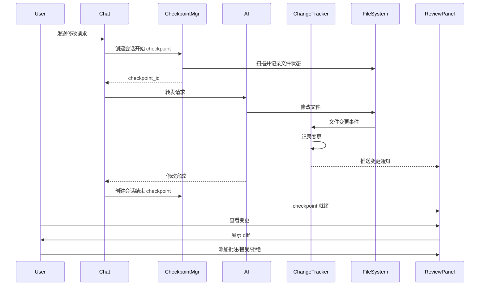

# AI 代码修改追踪与 Review 系统设计

> 文档状态：提议
> 创建日期：2025-01-25
> 作者：Claude

## 1. 概述

### 1.1 背景

当前 AI-Loom 的工作流存在以下问题：
- 无法追踪 AI 修改了哪些代码
- 缺少类似 Git diff 的可视化对比
- 没有暂存区概念来管理 AI 的修改
- 无法快速 review AI 的改动并添加批注

### 1.2 目标

设计并实现一个完整的 AI 代码修改追踪系统，支持：
- **Checkpoint 机制**：记录 AI 会话开始和结束时的代码状态
- **变更追踪**：实时追踪 AI 修改的所有文件
- **Diff 视图**：可视化展示代码变更
- **Review 流程**：支持对 AI 修改进行批注和二次编辑

## 2. 技术方案

### 2.1 架构设计

```
┌────────────────────────────────────────────────────┐
│                   前端界面                          │
├──────────┬───────────┬──────────┬─────────────────┤
│  Chat    │  Explorer │   Diff   │   Review Panel  │
│  Module  │  Module   │  Viewer  │   (批注+操作)    │
└──────────┴───────────┴──────────┴─────────────────┘
           │                                │
           ▼                                ▼
┌────────────────────────────────────────────────────┐
│              WebSocket Event Bus                   │
├────────────────────────────────────────────────────┤
│                  后端服务                           │
├─────────┬──────────┬───────────┬──────────────────┤
│  Chat   │Checkpoint│  Change   │   Annotation     │
│  API    │ Manager  │  Tracker  │     Store        │
└─────────┴──────────┴───────────┴──────────────────┘
           │                      │
           ▼                      ▼
    ┌─────────────┐        ┌──────────────┐
    │   SQLite    │        │  File System │
    └─────────────┘        └──────────────┘
```

### 2.2 核心组件

#### 2.2.1 Checkpoint Manager（检查点管理器）

负责创建和管理代码快照。

**数据模型**：
```rust
// packages/rust/crates/ailoom-store/src/checkpoint.rs
pub struct Checkpoint {
    pub id: String,                      // UUID
    pub conversation_id: String,         // 关联的会话 ID
    pub created_at: String,               // 创建时间
    pub checkpoint_type: CheckpointType, // 类型：会话开始/结束/手动
    pub description: String,              // 描述
    pub file_snapshots: Vec<FileSnapshot>, // 文件快照列表
}

pub enum CheckpointType {
    SessionStart,    // AI 会话开始
    SessionEnd,      // AI 会话结束
    Manual,          // 用户手动创建
    AutoSave,        // 自动保存
}

pub struct FileSnapshot {
    pub file_path: String,
    pub content_hash: String,  // SHA256
    pub content: Option<String>, // 可选：全量内容
    pub size: u64,
}
```

**存储策略**：
```rust
// 混合存储策略
pub struct CheckpointStorage {
    // 策略1：增量存储（默认）
    // 只存储变更的文件，通过 git 获取基线
    incremental: IncrementalStorage,

    // 策略2：全量存储
    // 存储所有相关文件的完整内容
    full: FullStorage,

    // 策略3：压缩存储
    // 使用 zstd 压缩存储
    compressed: CompressedStorage,
}

impl CheckpointStorage {
    pub async fn create_checkpoint(&self, conversation_id: &str) -> Result<Checkpoint> {
        // 1. 获取当前工作区所有文件状态
        let files = self.scan_workspace().await?;

        // 2. 计算每个文件的 hash
        let snapshots = files.iter()
            .map(|f| self.create_snapshot(f))
            .collect::<Vec<_>>();

        // 3. 根据策略存储
        match self.strategy {
            StorageStrategy::Incremental => {
                // 只存储与上一个 checkpoint 不同的文件
                self.store_incremental(snapshots).await?
            },
            StorageStrategy::Full => {
                // 存储所有文件
                self.store_full(snapshots).await?
            },
            StorageStrategy::Compressed => {
                // 压缩后存储
                self.store_compressed(snapshots).await?
            }
        }

        // 4. 创建 checkpoint 记录
        let checkpoint = Checkpoint {
            id: Uuid::new_v4().to_string(),
            conversation_id: conversation_id.to_string(),
            created_at: Utc::now().to_rfc3339(),
            checkpoint_type: CheckpointType::SessionStart,
            file_snapshots: snapshots,
        };

        self.store.insert_checkpoint(&checkpoint).await?;
        Ok(checkpoint)
    }
}
```

#### 2.2.2 Change Tracker（变更追踪器）

实时追踪文件变更。

**实现方式**：
```rust
// packages/rust/ailoom-server/src/services/change_tracker.rs
pub struct ChangeTracker {
    current_checkpoint: Option<String>,
    changes: Arc<Mutex<Vec<FileChange>>>,
    file_watcher: FileWatcher,
}

pub struct FileChange {
    pub id: String,
    pub checkpoint_id: String,
    pub file_path: String,
    pub change_type: ChangeType,
    pub old_content: Option<String>,
    pub new_content: Option<String>,
    pub diff: Option<String>,        // unified diff 格式
    pub timestamp: String,
    pub triggered_by: TriggerSource, // AI/用户/系统
}

pub enum ChangeType {
    Created,
    Modified,
    Deleted,
    Renamed { from: String, to: String },
}

pub enum TriggerSource {
    AI { conversation_id: String, message_id: String },
    User,
    System,
}

impl ChangeTracker {
    pub async fn track_file_change(&self, path: &str, source: TriggerSource) -> Result<()> {
        let old_content = self.get_file_at_checkpoint(path).await?;
        let new_content = fs::read_to_string(path).ok();

        // 生成 diff
        let diff = if let (Some(old), Some(new)) = (&old_content, &new_content) {
            Some(create_unified_diff(old, new, path))
        } else {
            None
        };

        let change = FileChange {
            id: Uuid::new_v4().to_string(),
            checkpoint_id: self.current_checkpoint.clone().unwrap_or_default(),
            file_path: path.to_string(),
            change_type: determine_change_type(&old_content, &new_content),
            old_content,
            new_content,
            diff,
            timestamp: Utc::now().to_rfc3339(),
            triggered_by: source,
        };

        // 存储变更
        self.changes.lock().unwrap().push(change.clone());

        // 广播变更事件
        if let Some(hub) = &self.ws_hub {
            hub.broadcast("file.changed.tracked", json!({
                "change": change,
                "checkpoint_id": self.current_checkpoint,
            }));
        }

        Ok(())
    }
}
```

#### 2.2.3 Diff Viewer（差异查看器）

前端组件，展示代码差异。

```typescript
// packages/web/src/features/review/components/diff-viewer.tsx
import { DiffEditor } from '@monaco-editor/react';

interface DiffViewerProps {
  checkpoint: Checkpoint;
  changes: FileChange[];
  onAddAnnotation: (change: FileChange, line: number, comment: string) => void;
}

export function DiffViewer({ checkpoint, changes, onAddAnnotation }: DiffViewerProps) {
  const [selectedFile, setSelectedFile] = useState<FileChange>();
  const [viewMode, setViewMode] = useState<'inline' | 'side-by-side'>('side-by-side');

  return (
    <div className="diff-viewer">
      {/* 文件列表 */}
      <div className="file-list">
        <h3>变更文件 ({changes.length})</h3>
        {changes.map(change => (
          <FileChangeItem
            key={change.id}
            change={change}
            onClick={() => setSelectedFile(change)}
            selected={selectedFile?.id === change.id}
          />
        ))}
      </div>

      {/* Diff 编辑器 */}
      {selectedFile && (
        <div className="diff-editor-container">
          <DiffEditor
            original={selectedFile.old_content || ''}
            modified={selectedFile.new_content || ''}
            language={detectLanguage(selectedFile.file_path)}
            options={{
              renderSideBySide: viewMode === 'side-by-side',
              readOnly: true,
              renderIndicators: true,
              renderOverviewRuler: true,
            }}
            onMount={(editor) => {
              // 添加右键菜单支持批注
              editor.addAction({
                id: 'add-annotation',
                label: '添加批注',
                contextMenuGroupId: 'review',
                run: () => {
                  const selection = editor.getSelection();
                  if (selection) {
                    showAnnotationDialog(selection);
                  }
                }
              });
            }}
          />

          {/* 批注浮层 */}
          <AnnotationOverlay
            changes={selectedFile}
            onAdd={(line, comment) => onAddAnnotation(selectedFile, line, comment)}
          />
        </div>
      )}
    </div>
  );
}

// 文件变更项组件
function FileChangeItem({ change, onClick, selected }: any) {
  const getChangeIcon = (type: ChangeType) => {
    switch (type) {
      case 'Created': return <PlusCircle className="text-green-500" />;
      case 'Modified': return <Edit className="text-yellow-500" />;
      case 'Deleted': return <MinusCircle className="text-red-500" />;
      case 'Renamed': return <ArrowRight className="text-blue-500" />;
    }
  };

  const getChangeStats = (diff?: string) => {
    if (!diff) return { additions: 0, deletions: 0 };
    const lines = diff.split('\n');
    const additions = lines.filter(l => l.startsWith('+')).length;
    const deletions = lines.filter(l => l.startsWith('-')).length;
    return { additions, deletions };
  };

  const stats = getChangeStats(change.diff);

  return (
    <div
      className={cn(
        'file-change-item',
        selected && 'selected'
      )}
      onClick={onClick}
    >
      {getChangeIcon(change.change_type)}
      <span className="file-path">{change.file_path}</span>
      <div className="change-stats">
        <span className="additions">+{stats.additions}</span>
        <span className="deletions">-{stats.deletions}</span>
      </div>
    </div>
  );
}
```

#### 2.2.4 Review Panel（审查面板）

整合所有 review 功能的面板。

```typescript
// packages/web/src/features/review/components/review-panel.tsx
export function ReviewPanel() {
  const { conversationId } = useChatStore();
  const [checkpoints, setCheckpoints] = useState<Checkpoint[]>([]);
  const [currentCheckpoint, setCurrentCheckpoint] = useState<Checkpoint>();
  const [changes, setChanges] = useState<FileChange[]>([]);
  const [reviewStatus, setReviewStatus] = useState<ReviewStatus>('pending');

  // 获取 checkpoints
  const { data: checkpointData } = useQuery({
    queryKey: ['checkpoints', conversationId],
    queryFn: () => api.getCheckpoints(conversationId),
    enabled: !!conversationId,
  });

  // 获取变更
  const { data: changesData } = useQuery({
    queryKey: ['changes', currentCheckpoint?.id],
    queryFn: () => api.getChanges(currentCheckpoint!.id),
    enabled: !!currentCheckpoint,
  });

  return (
    <div className="review-panel">
      {/* 顶部工具栏 */}
      <ReviewToolbar>
        <CheckpointSelector
          checkpoints={checkpoints}
          current={currentCheckpoint}
          onChange={setCurrentCheckpoint}
        />

        <div className="review-actions">
          <Button onClick={createCheckpoint}>
            <Camera /> 创建快照
          </Button>

          <Button onClick={acceptAllChanges} variant="success">
            <Check /> 接受所有
          </Button>

          <Button onClick={rejectAllChanges} variant="danger">
            <X /> 拒绝所有
          </Button>

          <Button onClick={exportDiff}>
            <Download /> 导出 Diff
          </Button>
        </div>
      </ReviewToolbar>

      {/* 变更统计 */}
      <ChangesSummary changes={changes} />

      {/* Diff 查看器 */}
      <DiffViewer
        checkpoint={currentCheckpoint}
        changes={changes}
        onAddAnnotation={handleAddAnnotation}
      />

      {/* 批注列表 */}
      <AnnotationsList
        changes={changes}
        annotations={annotations}
        onReply={handleReply}
        onResolve={handleResolve}
      />

      {/* 操作面板 */}
      <ReviewActions
        onAccept={handleAcceptChange}
        onReject={handleRejectChange}
        onModify={handleModifyChange}
      />
    </div>
  );
}
```

### 2.3 工作流程

#### 2.3.1 AI 修改代码流程



#### 2.3.2 Review 流程

```typescript
// packages/web/src/features/review/workflows/review-workflow.ts
export class ReviewWorkflow {
  async startReview(conversationId: string) {
    // 1. 获取会话的所有 checkpoints
    const checkpoints = await api.getCheckpoints(conversationId);

    // 2. 默认选择最新的 checkpoint 对
    const latest = checkpoints[checkpoints.length - 1];
    const previous = checkpoints[checkpoints.length - 2];

    // 3. 获取两个 checkpoint 之间的变更
    const changes = await api.getChangesBetween(previous.id, latest.id);

    // 4. 对每个变更创建 review 任务
    const reviewTasks = changes.map(change => ({
      id: generateId(),
      changeId: change.id,
      status: 'pending',
      annotations: [],
      decision: null, // accept/reject/modify
    }));

    return {
      checkpoints: [previous, latest],
      changes,
      reviewTasks,
    };
  }

  async processReviewDecision(
    changeId: string,
    decision: 'accept' | 'reject' | 'modify',
    modifiedContent?: string
  ) {
    switch (decision) {
      case 'accept':
        // 保持当前状态
        await api.markChangeAsReviewed(changeId, 'accepted');
        break;

      case 'reject':
        // 恢复到变更前的状态
        const change = await api.getChange(changeId);
        await fs.writeFile(change.file_path, change.old_content);
        await api.markChangeAsReviewed(changeId, 'rejected');
        break;

      case 'modify':
        // 应用修改后的内容
        if (modifiedContent) {
          const change = await api.getChange(changeId);
          await fs.writeFile(change.file_path, modifiedContent);
          await api.markChangeAsReviewed(changeId, 'modified');
        }
        break;
    }
  }

  async completeReview(reviewId: string) {
    // 1. 确保所有变更都已处理
    const unreviewed = await api.getUnreviewedChanges(reviewId);
    if (unreviewed.length > 0) {
      throw new Error(`还有 ${unreviewed.length} 个变更未处理`);
    }

    // 2. 创建 review 完成的 checkpoint
    await api.createCheckpoint({
      type: 'review_complete',
      description: `Review #${reviewId} 完成`,
    });

    // 3. 可选：提交到 git
    if (await confirm('是否提交到 Git？')) {
      await gitCommit(`Review #${reviewId}: AI 修改已审核`);
    }
  }
}
```

### 2.4 数据库设计

```sql
-- Checkpoints 表
CREATE TABLE checkpoints (
  id TEXT PRIMARY KEY,
  conversation_id TEXT NOT NULL,
  checkpoint_type TEXT NOT NULL, -- 'session_start', 'session_end', 'manual', 'auto_save'
  description TEXT,
  created_at TEXT NOT NULL,
  metadata JSON, -- 额外元数据

  FOREIGN KEY (conversation_id) REFERENCES conversations(id)
);

-- File Snapshots 表
CREATE TABLE file_snapshots (
  id TEXT PRIMARY KEY,
  checkpoint_id TEXT NOT NULL,
  file_path TEXT NOT NULL,
  content_hash TEXT NOT NULL,
  content TEXT, -- 可选：全量内容
  size INTEGER NOT NULL,
  created_at TEXT NOT NULL,

  FOREIGN KEY (checkpoint_id) REFERENCES checkpoints(id),
  UNIQUE(checkpoint_id, file_path)
);

-- File Changes 表
CREATE TABLE file_changes (
  id TEXT PRIMARY KEY,
  checkpoint_id TEXT NOT NULL,
  file_path TEXT NOT NULL,
  change_type TEXT NOT NULL, -- 'created', 'modified', 'deleted', 'renamed'
  old_content TEXT,
  new_content TEXT,
  diff TEXT, -- unified diff 格式
  triggered_by TEXT NOT NULL, -- 'ai', 'user', 'system'
  trigger_metadata JSON, -- 包含 conversation_id, message_id 等
  timestamp TEXT NOT NULL,
  review_status TEXT DEFAULT 'pending', -- 'pending', 'accepted', 'rejected', 'modified'
  reviewed_at TEXT,
  reviewed_by TEXT,

  FOREIGN KEY (checkpoint_id) REFERENCES checkpoints(id)
);

-- Change Annotations 表（扩展现有 annotations 表）
CREATE TABLE change_annotations (
  id TEXT PRIMARY KEY,
  change_id TEXT NOT NULL,
  annotation_id TEXT NOT NULL,

  FOREIGN KEY (change_id) REFERENCES file_changes(id),
  FOREIGN KEY (annotation_id) REFERENCES annotations(id),
  UNIQUE(change_id, annotation_id)
);

-- 创建索引
CREATE INDEX idx_checkpoints_conversation ON checkpoints(conversation_id);
CREATE INDEX idx_snapshots_checkpoint ON file_snapshots(checkpoint_id);
CREATE INDEX idx_changes_checkpoint ON file_changes(checkpoint_id);
CREATE INDEX idx_changes_status ON file_changes(review_status);
CREATE INDEX idx_changes_timestamp ON file_changes(timestamp);
```

### 2.5 API 设计

```typescript
// REST API 端点

// Checkpoint 相关
POST   /api/checkpoints                     // 创建 checkpoint
GET    /api/checkpoints?conversationId=xxx  // 获取会话的所有 checkpoints
GET    /api/checkpoints/:id                 // 获取单个 checkpoint
DELETE /api/checkpoints/:id                 // 删除 checkpoint

// 变更相关
GET    /api/changes?checkpointId=xxx        // 获取 checkpoint 的所有变更
GET    /api/changes/between?from=xxx&to=yyy // 获取两个 checkpoint 间的变更
GET    /api/changes/:id                     // 获取单个变更详情
PUT    /api/changes/:id/review              // 更新变更的 review 状态
POST   /api/changes/:id/annotations         // 为变更添加批注

// Diff 相关
GET    /api/diff?file=xxx&from=yyy&to=zzz  // 获取文件在两个 checkpoint 间的 diff
GET    /api/diff/unified?checkpointId=xxx   // 获取 unified diff

// Review 相关
POST   /api/reviews                         // 创建 review 会话
GET    /api/reviews/:id                     // 获取 review 详情
PUT    /api/reviews/:id/complete            // 完成 review
GET    /api/reviews/:id/export              // 导出 review 报告

// WebSocket 事件
checkpoint.created    // 新 checkpoint 创建
change.detected       // 检测到文件变更
change.reviewed       // 变更已审核
review.completed      // Review 完成
```

## 3. UI/UX 设计

### 3.1 界面布局

```
┌─────────────────────────────────────────────────────────────┐
│                        顶部导航栏                            │
├────────┬─────────────────────────────────┬─────────────────┤
│        │                                   │                 │
│  侧边栏 │          主内容区                 │   Review 面板    │
│        │                                   │                 │
│  Chat  │  ┌─────────────────────────┐     │ ┌─────────────┐ │
│Explorer│  │    Checkpoint 时间线     │     │ │ 变更列表     │ │
│ Review │  ├─────────────────────────┤     │ ├─────────────┤ │
│        │  │                         │     │ │ 批注列表     │ │
│        │  │     Diff Viewer         │     │ ├─────────────┤ │
│        │  │                         │     │ │ 操作按钮     │ │
│        │  └─────────────────────────┘     │ └─────────────┘ │
└────────┴─────────────────────────────────┴─────────────────┘
```

### 3.2 交互设计

1. **Checkpoint 时间线**
   - 可视化展示所有 checkpoint
   - 支持拖动选择对比范围
   - 显示每个 checkpoint 的摘要信息

2. **变更列表**
   - 树形展示变更文件
   - 颜色编码表示变更类型
   - 显示变更统计（+增加行数，-删除行数）

3. **Diff 查看器**
   - 支持并排/内联两种模式
   - 语法高亮
   - 支持在 diff 上直接添加批注
   - 快捷键导航（上一个/下一个变更）

4. **批注集成**
   - 在 diff 行上右键添加批注
   - 批注与具体变更关联
   - 支持批注会话（回复/解决）

## 4. 实施计划

### Phase 1：基础架构（1周）
- [ ] 实现 Checkpoint Manager
- [ ] 实现 Change Tracker
- [ ] 数据库 schema 迁移
- [ ] 基础 API 实现

### Phase 2：前端实现（2周）
- [ ] Diff Viewer 组件
- [ ] Review Panel 实现
- [ ] Checkpoint 时间线
- [ ] 与现有批注系统集成

### Phase 3：优化完善（1周）
- [ ] 性能优化（大文件 diff）
- [ ] 导出功能（生成报告）
- [ ] Git 集成
- [ ] 测试完善

## 5. 性能考虑

### 5.1 存储优化
- 使用增量存储减少空间占用
- 定期清理过期 checkpoint
- 压缩大文件内容

### 5.2 Diff 性能
- 大文件使用流式 diff
- 实现 diff 缓存
- 虚拟滚动展示长 diff

### 5.3 实时性
- 使用 WebSocket 推送变更
- 批量处理文件变更事件
- 防抖处理频繁变更

## 6. 与现有功能集成

### 6.1 批注系统
- 批注可以关联到具体的变更
- 在 diff 视图中展示相关批注
- 支持基于变更的批注过滤

### 6.2 聊天模块
- 聊天界面显示 checkpoint 状态
- 支持从聊天直接跳转到 review
- AI 回复中引用变更信息

### 6.3 文件浏览器
- 标记有变更的文件
- 快速跳转到变更位置
- 显示文件的变更历史

## 7. 配置选项

```typescript
// 用户可配置项
interface ReviewConfig {
  // Checkpoint 策略
  checkpoint: {
    autoCreate: boolean;        // 自动创建 checkpoint
    autoSaveInterval: number;   // 自动保存间隔（秒）
    storageStrategy: 'incremental' | 'full' | 'compressed';
    retentionDays: number;      // 保留天数
  };

  // 变更追踪
  tracking: {
    enabled: boolean;           // 启用变更追踪
    excludePatterns: string[];  // 排除的文件模式
    includePatterns: string[];  // 包含的文件模式
  };

  // Review 设置
  review: {
    requireReview: boolean;     // 强制 review
    autoAcceptTimeout: number;  // 自动接受超时（秒）
    exportFormat: 'html' | 'markdown' | 'pdf';
  };

  // UI 偏好
  ui: {
    diffViewMode: 'inline' | 'side-by-side';
    syntaxHighlight: boolean;
    showLineNumbers: boolean;
    contextLines: number;       // diff 上下文行数
  };
}
```

## 8. 错误处理

1. **Checkpoint 创建失败**
   - 回退机制
   - 错误通知
   - 重试选项

2. **变更追踪丢失**
   - 从文件系统重建
   - 警告提示
   - 手动刷新

3. **Diff 计算超时**
   - 大文件提示
   - 分块处理
   - 跳过选项

## 9. 测试策略

### 9.1 单元测试
- Checkpoint Manager 测试
- Change Tracker 测试
- Diff 算法测试

### 9.2 集成测试
- 完整 review 流程测试
- WebSocket 事件测试
- 数据一致性测试

### 9.3 E2E 测试
- 用户 review 流程
- 批注创建和关联
- 导出功能测试

## 10. 未来扩展

1. **智能 Review**
   - AI 辅助代码审查
   - 自动识别潜在问题
   - 建议优化方案

2. **协作 Review**
   - 多人同时 review
   - 评论和讨论
   - 投票机制

3. **版本对比**
   - 支持任意版本对比
   - 分支管理
   - 合并冲突解决

4. **度量分析**
   - 代码质量指标
   - 修改频率分析
   - Review 效率统计